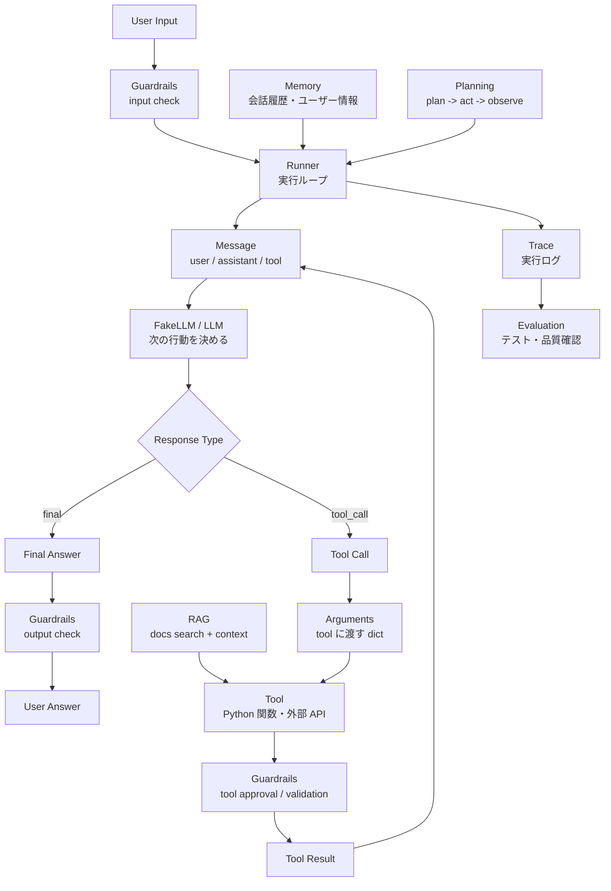

# AI Agent Drill

Python は書けるけれど、AI Agent はまだよく分からない人のための実装ドリルです。

この README では、AI Agent に必要な部品を「なぜ必要なのか」から説明し、そのあとに小さな Drill で 1 つずつ実装します。最初は本物の API を使わず、Fake LLM で Agent の制御フローだけを練習します。

最終的には、Tool Calling、Memory、RAG、Planning、Guardrails、Evaluation、Production 風の API / CLI 実装まで進みます。

## この教材の対象読者

この教材は、次のような人を想定しています。

- Python の関数、class、dict、list はある程度書ける
- Web API や LLM API の経験は少なくてもよい
- LangChain や Agents SDK などのフレームワークを使う前に、中身の動きを理解したい
- 「Agent が tool を呼ぶ」と言われても、実際に何が起きているのかまだ曖昧
- いきなり大きな Agent アプリを作るより、小さい部品から順番に理解したい

---

## AI Agent とは何か

この教材では、AI Agent を次のように考えます。

```text
ユーザーの入力を受け取り、
LLM が次の行動を決め、
必要なら tool を実行し、
結果を見て、
最終回答を返すプログラム
```

通常のチャットボットは、ユーザー入力に対して文章を返すだけです。

```text
user -> LLM -> answer
```

Agent は、その途中で tool を呼んだり、履歴を見たり、検索したり、計画を立てたりします。

```text
user
  -> LLM
  -> tool call
  -> tool result
  -> LLM
  -> final answer
```

つまり Agent 実装の中心は、「LLM の返答を見て、次に何をするかをプログラムが判断すること」です。

---

## AI Agent に必要な部品

AI Agent は魔法の 1 つのクラスではなく、小さな部品の組み合わせです。

### 全体像

まず、部品同士の関係を 1 枚で見ると次のようになります。



読み方はシンプルです。

- `Runner` が中心にいて、LLM に聞く、tool を実行する、結果を履歴に戻す、を繰り返す
- `Message` は、user 入力、assistant の tool call、tool result、final answer を同じ形式で持つ履歴
- `FakeLLM` は練習用の LLM で、`Response Type` として `final` か `tool_call` を返す
- `tool_call` のときは、`Arguments` を使って `Tool` を実行し、結果を `Message` に戻す
- `Memory` は過去の会話やユーザー情報を Runner に渡す
- `RAG` は検索用 tool として入り、外部ドキュメントを根拠として使う
- `Planning` は Runner の動きを「計画 -> 実行 -> 観察」に広げる
- `Guardrails` は入力、tool 実行前、出力の各ポイントで危険や不正確さを止める
- `Trace` は実行中に何が起きたかを記録し、`Evaluation` はその記録やテストケースで品質を確認する

### Message

`Message` は、会話履歴の 1 件分です。

```python
{
    "role": "user",
    "content": "3 + 5 * 2 は？",
}
```

**なぜ必要か**

LLM は、今の入力だけでなく、過去の会話や tool の結果を見て次の返答を決めます。そのため、user、assistant、tool などの発言を同じ形式で保存する必要があります。

**このあと学ぶ Drill**

- Drill 0.4: tool result を message 風の dict にする
- Drill 1: `Message` class として扱う
- Drill 8: short-term memory

### Fake LLM

`FakeLLM` は、本物の LLM API の代わりに決まった返答を返す練習用のクラスです。

```python
{
    "type": "tool_call",
    "tool_name": "calculator",
    "arguments": {
        "expression": "3 + 5 * 2",
    },
}
```

**なぜ必要か**

最初から本物の API を使うと、LLM の出力ゆれ、API キー、課金、ネットワーク、SDK の書き方が同時に出てきます。まず Fake LLM を使うと、「Agent の制御フロー」だけに集中できます。

**このあと学ぶ Drill**

- Drill 0.1: final を返す
- Drill 0.2: tool_call を返す
- Drill 0.5: tool result を見て final を返す

### Response Type

`type` は、LLM の返答の種類です。

```python
{
    "type": "final",
    "content": "答えは13です。",
}
```

または、

```python
{
    "type": "tool_call",
    "tool_name": "calculator",
    "arguments": {
        "expression": "3 + 5 * 2",
    },
}
```

**なぜ必要か**

LLM の返答がただの文字列だと、プログラムは「最終回答なのか」「tool を呼ぶ指示なのか」を判断できません。`type` を付けることで、Runner が次の処理を分岐できます。

**このあと学ぶ Drill**

- Drill 0.1: `type: "final"`
- Drill 0.2: `type: "tool_call"`
- Drill 1: `type` を見て処理を分岐する

### Tool

`Tool` は、LLM から呼び出せる Python 関数です。

```python
def calculator(expression: str) -> int:
    return 13
```

**なぜ必要か**

LLM は文章生成は得意ですが、計算、ファイル操作、検索、DB 更新、外部 API 呼び出しなどは Python の関数に任せたほうが確実です。Agent は LLM と tool を組み合わせることで、文章を返すだけでなく「行動」できるようになります。

**このあと学ぶ Drill**

- Drill 0.3: arguments で関数を呼ぶ
- Drill 3: calculator tool
- Drill 4: dictionary search tool
- Drill 5: tool error handling

### Arguments

`arguments` は、tool に渡す引数です。

```python
{
    "arguments": {
        "expression": "3 + 5 * 2",
    }
}
```

**なぜ必要か**

Runner は、LLM が選んだ tool を Python 関数として実行します。そのとき `arguments` が dict なら、次のように呼び出せます。

```python
calculator(**arguments)
```

これは次と同じ意味です。

```python
calculator(expression="3 + 5 * 2")
```

**このあと学ぶ Drill**

- Drill 0.3: `calculator(**tool_call["arguments"])`
- Drill 3: arguments validation

### Runner

`Runner` は、Agent の実行ループを担当する部品です。

```text
LLM に聞く
  -> tool_call なら tool を実行する
  -> tool result を messages に追加する
  -> もう一度 LLM に聞く
  -> final なら終了する
```

**なぜ必要か**

LLM は「次に何をしたいか」を返すだけです。実際に tool を探して実行し、結果を履歴に追加し、もう一度 LLM を呼ぶのはアプリ側の仕事です。その司令塔が Runner です。

**このあと学ぶ Drill**

- Drill 1: Agent ループを書く
- Drill 2: `max_turns` で無限ループを防ぐ
- Drill 14: stop condition

### Memory

`Memory` は、過去の会話やユーザー情報を保存する仕組みです。

**なぜ必要か**

毎回の入力だけを見る Agent は、過去に何を話したかを忘れます。会話履歴、要約、ユーザーの好みを保存することで、連続した会話ができるようになります。

**このあと学ぶ Drill**

- Drill 8: short-term memory
- Drill 9: summary memory
- Drill 10: key-value memory

### RAG

`RAG` は、外部ドキュメントを検索して、その内容をもとに回答する仕組みです。

**なぜ必要か**

LLM の記憶だけで答えると、古い情報や存在しない情報を断定することがあります。ドキュメントを検索し、根拠を回答に含めることで、業務知識や社内 FAQ に基づいた回答ができます。

**このあと学ぶ Drill**

- Drill 11: keyword search RAG
- Drill 12: citation 付き回答

### Planning

`Planning` は、いきなり答えずに作業手順を立てる仕組みです。

**なぜ必要か**

複雑な依頼では、検索、要約、検証、回答作成などの複数ステップが必要になります。計画を状態として持つことで、今どこまで終わったか、次に何をするかを管理できます。

**このあと学ぶ Drill**

- Drill 13: plan -> act -> observe loop
- Drill 14: stop condition

### Guardrails

`Guardrails` は、危険な入力、危険な tool 実行、不正確な出力を止める仕組みです。

**なぜ必要か**

Agent は tool を実行できるため、普通のチャットより慎重に扱う必要があります。API キーの表示、削除操作、根拠のない断定などを防ぐために、入力・tool・出力を検査します。

**このあと学ぶ Drill**

- Drill 17: input guardrail
- Drill 18: tool approval
- Drill 19: output guardrail

### Trace / Evaluation

`Trace` は Agent の実行ログ、`Evaluation` は Agent のテストです。

**なぜ必要か**

Agent は内部で LLM 呼び出し、tool call、tool result、final answer など複数のイベントを起こします。失敗したときに原因を追えるように trace が必要です。また、変更しても性能が落ちていないか確認するために eval dataset が必要です。

**このあと学ぶ Drill**

- Drill 20: trace logger
- Drill 21: eval dataset

---

## この教材で作る流れ

最初から全部を作るのではなく、次の順番で少しずつ足します。

```text
Level 0: Fake LLM の返答形式を覚える
Level 1: Agent の基本ループを作る
Level 2: Tool Calling を増やす
Level 3: Structured Output を扱う
Level 4: Memory を作る
Level 5: RAG を作る
Level 6: Planning Agent を作る
Level 7: Multi-Agent / Handoff を作る
Level 8: Guardrails を作る
Level 9: Trace / Evaluation を作る
Level 10: CLI / API / SQLite で Production 風にまとめる
```

---

## 進め方

- 1 Drill ずつ小さく実装する
- 本物の API を使う前に、Fake LLM で制御フローを確認する
- 各 Drill の「合格条件」をテストとして書く
- 失敗した Drill は、翌日に何も見ずに再実装する
- Drill 1 が重く感じたら、先に Level 0 を終わらせる

---

## 導入: なぜ Fake LLM は dict を返すのか

Fake LLM は、ただの文字列ではなく `dict` を返します。

```python
{
    "type": "final",
    "content": "こんにちは！",
}
```

これは Runner が「次に何をすればいいか」を判断できるようにするためです。

もし Fake LLM が文字列だけを返した場合、人間には意味が分かっても、プログラムには判断材料が足りません。

```python
"こんにちは！"
```

これだけだと、Runner は次のことを判定できません。

- これは最終回答なのか
- tool を呼ぶ指示なのか
- エラーなのか
- まだ処理を続けるべきなのか

そこで、返答に `type` を付けます。

```python
{
    "type": "final",
    "content": "こんにちは！",
}
```

この形なら Runner はこう書けます。

```python
if response["type"] == "final":
    print(response["content"])
```

tool を呼びたいときは、別の `type` を返します。

```python
{
    "type": "tool_call",
    "tool_name": "calculator",
    "arguments": {
        "expression": "3 + 5 * 2",
    },
}
```

この形なら Runner はこう書けます。

```python
if response["type"] == "tool_call":
    tool_name = response["tool_name"]
    arguments = response["arguments"]
```

つまり、Fake LLM の返答は「文章」ではなく「プログラムが読める命令」として作ります。

---

## Fake LLM の返答を書くお作法

Fake LLM の返答は、最初は次の 2 種類だけ覚えれば十分です。

### 1. 最終回答を返すとき

ユーザーに返す文章が完成したときは、`type` を `final` にします。

```python
{
    "type": "final",
    "content": "答えは13です。",
}
```

**意味**

- `type`: 返答の種類
- `final`: これで処理を終了してよい
- `content`: ユーザーに見せる最終回答

**Runner 側の処理**

```python
if response["type"] == "final":
    final_answer = response["content"]
```

### 2. tool を呼びたいとき

LLM が自分で答えず、tool に処理を任せたいときは、`type` を `tool_call` にします。

```python
{
    "type": "tool_call",
    "tool_name": "calculator",
    "arguments": {
        "expression": "3 + 5 * 2",
    },
}
```

**意味**

- `type`: 返答の種類
- `tool_call`: tool を呼んでほしい
- `tool_name`: 呼びたい tool の名前
- `arguments`: tool に渡す引数

**Runner 側の処理**

```python
if response["type"] == "tool_call":
    tool_name = response["tool_name"]
    arguments = response["arguments"]
    result = calculator(**arguments)
```

### 返答を書くときのルール

- 必ず `type` を入れる
- 最終回答なら `type: "final"` と `content` を入れる
- tool 呼び出しなら `type: "tool_call"`、`tool_name`、`arguments` を入れる
- `arguments` は必ず dict にする
- `arguments` の key は、呼び出す関数の引数名と合わせる

例えば、calculator がこう定義されているなら、

```python
def calculator(expression: str) -> int:
    ...
```

`arguments` はこう書きます。

```python
{
    "arguments": {
        "expression": "3 + 5 * 2",
    }
}
```

これは、Runner があとで次のように呼び出すためです。

```python
calculator(**arguments)
```

`**arguments` は dict を関数の引数として展開します。

```python
calculator(**{"expression": "3 + 5 * 2"})
```

これは次と同じ意味です。

```python
calculator(expression="3 + 5 * 2")
```

---

## Level 0: Agent の材料を分解して覚える

Drill 1 は「最初の統合問題」です。いきなり `Message`、`Tool`、`Agent`、`Runner`、`FakeLLM` を全部考えると負荷が高いので、まずは部品を 1 つずつ練習します。

### Drill 0.1: Fake LLM が final を返す

LLM の返答を、ただの `dict` として扱う練習です。

**実装例ファイル**

`drill_0_1_fake_llm_final.py`

**お題**

Fake LLM に `こんにちは` と渡したら、final answer の dict を返します。

**実装例**

```python
class FakeLLM:
    def chat(self, messages: str) -> dict:
        return {
            "type": "final",
            "content": "こんにちは！",
        }


llm = FakeLLM()
response = llm.chat("こんにちは")

print(response)
print(response["content"])
```

**合格条件**

- `response["type"]` が `final`
- `response["content"]` が `こんにちは！`
- まずは messages や Runner は作らない

### Drill 0.2: Fake LLM が tool_call を返す

LLM が「自分で計算する」のではなく、「tool を呼んで」と返す感覚をつかみます。

**実装例ファイル**

`drill_0_2_fake_llm_tool_call.py`

**お題**

Fake LLM に `3 + 5 * 2 は？` と渡したら、calculator 用の tool call を返します。

**実装例**

```python
class FakeLLM:
    def chat(self, messages: str) -> dict:
        return {
            "type": "tool_call",
            "tool_name": "calculator",
            "arguments": {
                "expression": "3 + 5 * 2",
            },
        }


llm = FakeLLM()
response = llm.chat("3 + 5 * 2 は？")

print(response["type"])
print(response["tool_name"])
print(response["arguments"]["expression"])
```

**合格条件**

- `response["type"]` が `tool_call`
- `response["tool_name"]` が `calculator`
- `response["arguments"]["expression"]` が `3 + 5 * 2`

### Drill 0.3: tool_call の arguments で関数を呼ぶ

`arguments` の dict を使って、Python の関数を呼ぶ練習です。

**実装例ファイル**

`drill_0_3_tool_arguments.py`

**お題**

tool_call から `expression` を取り出し、calculator を実行します。

**実装例**

```python
def calculator(expression: str) -> int:
    if expression == "3 + 5 * 2":
        return 13

    raise ValueError(f"unsupported expression: {expression}")


tool_call = {
    "tool_name": "calculator",
    "arguments": {
        "expression": "3 + 5 * 2",
    },
}

result = calculator(**tool_call["arguments"])

print(result)
```

**合格条件**

- 出力が `13`
- `calculator("3 + 5 * 2")` ではなく、`calculator(**tool_call["arguments"])` で呼ぶ

### Drill 0.4: tool result を message 風の dict にする

tool の実行結果を、次の LLM 呼び出しに渡せる形にします。

**実装例ファイル**

`drill_0_4_tool_result_message.py`

**お題**

calculator の結果を tool result message として保存します。

**実装例**

```python
tool_result_message = {
    "role": "tool",
    "content": {
        "tool_name": "calculator",
        "result": 13,
    },
}

print(tool_result_message["role"])
print(tool_result_message["content"]["result"])
```

**合格条件**

- `role` が `tool`
- `content["tool_name"]` が `calculator`
- `content["result"]` が `13`

### Drill 0.5: 2 回呼ぶ Fake LLM を作る

1 回目は tool_call、tool result がある 2 回目は final を返すようにします。

**実装例ファイル**

`drill_0_5_fake_llm_two_turns.py`

**お題**

messages に tool result がなければ tool_call、あれば final を返します。

**実装例**

```python
class FakeLLM:
    def chat(self, messages: list[dict]) -> dict:
        has_tool_result = any(message["role"] == "tool" for message in messages)

        if not has_tool_result:
            return {
                "type": "tool_call",
                "tool_name": "calculator",
                "arguments": {
                    "expression": "3 + 5 * 2",
                },
            }

        return {
            "type": "final",
            "content": "答えは13です。",
        }
```

**合格条件**

- messages が空なら `tool_call` を返す
- messages に `{"role": "tool", ...}` があれば `final` を返す
- ここまで来てから Drill 1 に進む

---

## Level 1: Agent の骨格を作る

### Drill 1: Fake LLM で Agent ループを書く

本物の API は使わず、Fake LLM を作って Agent の流れだけ実装します。Level 0 で作った部品を、`Message`、`Tool`、`Agent`、`Runner` にまとめる統合問題です。

**実装例ファイル**

`drill_1_agent_loop.py`

**お題**

ユーザー入力:

```text
3 + 5 * 2 は？
```

Fake LLM の 1 回目の返答:

```json
{
  "type": "tool_call",
  "tool_name": "calculator",
  "arguments": {
    "expression": "3 + 5 * 2"
  }
}
```

tool 実行後の Fake LLM の返答:

```json
{
  "type": "final",
  "content": "答えは13です。"
}
```

**実装するもの**

- `Message`
- `Tool`
- `Agent`
- `Runner`
- `calculator tool`
- `FakeLLM`

**合格条件**

- 入力: `3 + 5 * 2 は？`
- 出力: `答えは13です。`
- ログが次の順番で残る
  1. user message
  2. assistant tool_call
  3. tool result
  4. assistant final

### Drill 2: max_turns を入れる

Agent が無限に tool を呼び続ける Fake LLM を作ります。

**お題**

Fake LLM が毎回これを返します。

```json
{
  "type": "tool_call",
  "tool_name": "calculator",
  "arguments": {
    "expression": "1 + 1"
  }
}
```

**実装するもの**

- `max_turns`
- `max_turns` を超えたら例外
- 例外時のログ

**合格条件**

- `max_turns=3` のとき、4 回目に進まず停止する
- エラー内容に `max_turns exceeded` が含まれる

---

## Level 2: Tool Calling を体に覚えさせる

Tool use は、多くの Agent 実装の中心です。モデルが tool call を返し、アプリが実行して tool result を返す形を練習します。

### Drill 3: calculator tool

**お題**

次の入力に対応します。

```text
12 * 8 は？
100 / 4 + 7 は？
2 ** 10 は？
```

**実装するもの**

- tool schema
- arguments validation
- tool execution
- tool result message

**制約**

危険な式は実行しない。

禁止:

- `import`
- `open`
- `exec`
- `eval` の直接使用
- `__` が含まれる式

**合格条件**

- `12 * 8 は？` -> calculator が呼ばれる
- `こんにちは` -> calculator は呼ばれない
- `__import__('os')` -> 拒否される

### Drill 4: dictionary search tool

小さな辞書を検索する Agent を作ります。

**データ**

```python
FAQ = {
    "refund": "返金は購入から30日以内に申請できます。",
    "shipping": "通常配送は3〜5営業日です。",
    "password": "パスワード再設定ページから変更できます。",
}
```

**入力例**

```text
返金について教えて
配送にはどれくらいかかる？
パスワードを忘れました
```

**実装するもの**

- `search_faq tool`
- query string の validation
- 見つからないときの fallback

**合格条件**

- 返金 -> refund tool result を使う
- 配送 -> shipping tool result を使う
- 未知の質問 -> `見つかりませんでした` を含む

### Drill 5: tool error handling

天気 API 風の mock tool を作ります。

**tool**

```python
def get_weather(city: str) -> dict:
    ...
```

**挙動**

- Tokyo -> `{"city": "Tokyo", "weather": "sunny", "temp": 22}`
- Osaka -> `{"city": "Osaka", "weather": "cloudy", "temp": 20}`
- Unknown -> `ValueError` を raise

**実装するもの**

- tool 例外を握りつぶさない
- tool error message を履歴に追加
- LLM が最終回答でエラーを説明できるようにする

**合格条件**

- Tokyo の天気 -> 成功
- 存在しない都市 -> tool error がログに残る
- 最終回答に `取得できませんでした` が含まれる

---

## Level 3: Structured Output を反復する

自然文を後から parse するより、最初から JSON や Pydantic model として受ける形を練習します。

### Drill 6: TaskPlan を返す Agent

ユーザーの依頼から、作業計画を JSON で返します。

**入力**

```text
ブログ記事を調査して、構成を作って、下書きまで作ってください
```

**出力 schema**

```python
class TaskPlan(BaseModel):
    goal: str
    steps: list[str]
    tools_needed: list[str]
    risk_level: Literal["low", "medium", "high"]
```

**合格条件**

- JSON として parse できる
- Pydantic validation が通る
- `steps` が 3 個以上ある
- `risk_level` が `low` / `medium` / `high` のどれか

### Drill 7: 壊れた JSON を repair する

**お題**

Fake LLM が壊れた JSON を返します。

```text
{ goal: "調査する", steps: ["検索", "要約",], }
```

**実装するもの**

- parse 失敗を検出
- repair prompt を作る
- もう一度 LLM に投げる
- retry 回数制限

**合格条件**

- `retry=2` 以内に valid JSON になる
- retry 超過時は例外
- parse error のログが残る

---

## Level 4: Memory を作る

### Drill 8: short-term memory

会話履歴を保持する Memory を作ります。

**実装するもの**

- messages を保存
- 直近 N 件だけ取り出す
- `system` / `user` / `assistant` / `tool` の role を区別

**合格条件**

- `N=4` のとき、最新 4 件だけ prompt に入る
- tool result も履歴に残る
- 古い履歴は prompt に入らない

### Drill 9: summary memory

古い会話を summary に圧縮します。

**実装するもの**

- messages が 10 件を超えたら summary を更新
- summary + 最新 messages で prompt を作る
- summary 更新も Fake LLM でテスト

**合格条件**

- messages が 20 件あっても prompt には summary + 最新 N 件だけ入る
- summary にユーザーの好みが残る

### Drill 10: key-value memory

ユーザーの好みを保存する Agent を作ります。

**入力例**

```text
私はPythonが好きです
私は朝に集中できます
前に言った好きな言語は？
```

**実装するもの**

- `save_memory tool`
- `read_memory tool`
- memory store

**合格条件**

- `Pythonが好き` が保存される
- 後続質問で memory tool が呼ばれる
- 保存していない情報は勝手に作らない

---

## Level 5: RAG を作る

### Drill 11: keyword search RAG

まず embedding なしで作ります。

**データ**

```text
docs/
  refund.md
  shipping.md
  account.md
```

**実装するもの**

- markdown 読み込み
- chunk 分割
- keyword score
- top_k 取得
- context 付き回答

**合格条件**

- `返金期限は？` -> `refund.md` が top1
- `配送日数は？` -> `shipping.md` が top1
- `アカウント削除は？` -> `account.md` が top1

### Drill 12: citation 付き回答

RAG 回答に source を付けます。

**出力形式**

```json
{
  "answer": "...",
  "sources": [
    {
      "file": "refund.md",
      "quote": "購入から30日以内"
    }
  ]
}
```

**合格条件**

- `sources` が空でない
- `quote` が実際の document 内に存在する
- document にないことは `不明` と答える

---

## Level 6: Planning Agent を作る

### Drill 13: plan -> act -> observe loop

Agent が計画を立て、tool を使い、観察結果をもとに次の行動を決めます。

**入力**

```text
返金ポリシーを調べて、ユーザー向けに短く説明して
```

**実装する状態**

```python
class AgentState(BaseModel):
    goal: str
    plan: list[str]
    completed_steps: list[str]
    observations: list[str]
    final_answer: str | None
```

**合格条件**

1. plan が作られる
2. search tool が呼ばれる
3. observation が追加される
4. `final_answer` で終了する

### Drill 14: stop condition

Agent が「まだ調べます」を繰り返す状態を防ぎます。

**実装するもの**

- `max_steps`
- `goal_satisfied` 判定
- repeated_action 検出

**合格条件**

- 同じ tool + 同じ arguments が 3 回続いたら停止
- `max_steps` を超えたら停止
- 停止理由がログに残る

---

## Level 7: Multi-Agent / Handoff

Handoff は、ある Agent が別の専門 Agent へタスクを委譲するパターンです。

### Drill 15: router agent

問い合わせを 3 つの Agent に振り分けます。

**振り分け先**

- `BillingAgent`
- `TechSupportAgent`
- `GeneralFAQAgent`

**入力例**

```text
請求書を再発行したい
ログインできません
営業時間を教えて
```

**実装するもの**

- router
- route schema
- handoff
- handoff log

**route schema**

```python
class RouteDecision(BaseModel):
    target_agent: Literal["billing", "tech_support", "general_faq"]
    reason: str
```

**合格条件**

- 請求 -> BillingAgent
- ログイン不可 -> TechSupportAgent
- 営業時間 -> GeneralFAQAgent
- handoff 先の Agent 名がログに残る

### Drill 16: agents as tools

ManagerAgent が専門 Agent を tool として呼び出します。

**専門 Agent**

- `ResearchAgent`
- `WritingAgent`
- `ReviewAgent`

**入力**

```text
AI Agentについて短い記事を書いて
```

**実装する流れ**

```text
Manager
  -> ResearchAgent tool
  -> WritingAgent tool
  -> ReviewAgent tool
  -> final
```

**合格条件**

- 3 つの Agent tool が順番に呼ばれる
- 各 Agent の出力が次の Agent に渡る
- final に review 結果が反映される

---

## Level 8: Guardrails を作る

Guardrails は、入力・tool call・出力を検査して、危険な実行や不正な出力を止めるための仕組みです。

### Drill 17: input guardrail

危険な依頼を止めます。

**ブロック対象**

- API キーを表示して
- `rm -rf` を実行して
- 他人のパスワードを取得して

**実装するもの**

- `InputGuardrail`
- blocked reason
- safe fallback response

**合格条件**

- 危険入力 -> tool を呼ばずに停止
- 通常入力 -> Agent 実行
- blocked reason がログに残る

### Drill 18: tool approval

破壊的 tool には人間の承認を要求します。

**tools**

- `read_file(path)`
- `delete_file(path)`
- `send_email(to, body)`

**ルール**

- read_file -> 承認不要
- delete_file -> 承認必要
- send_email -> 承認必要

**合格条件**

- delete_file 実行前に `pending_approval` になる
- approve 後に実行される
- reject 後は実行されない

### Drill 19: output guardrail

最終回答を検査します。

**ルール**

- RAG 回答では sources 必須
- 個人情報を出さない
- `わかりません` を許可する
- document にない断定は禁止

**合格条件**

- sources なし -> reject
- document 外の断定 -> reject
- 不明と答える -> pass

---

## Level 9: Observability / Evaluation

### Drill 20: trace logger

Agent 実行の全イベントを JSONL で保存します。

**保存するイベント**

```json
{"type": "user_input", "content": "..."}
{"type": "llm_request", "messages": ["..."]}
{"type": "tool_call", "tool": "...", "arguments": {}}
{"type": "tool_result", "tool": "...", "result": "..."}
{"type": "final", "content": "..."}
{"type": "error", "message": "..."}
```

**合格条件**

- 1 回の Agent 実行で `trace_id` が 1 つ発行される
- 全イベントに timestamp がある
- tool_call と tool_result を対応付けられる

### Drill 21: eval dataset

20 件のテストケースで Agent を評価します。

**dataset 例**

```python
EVAL_CASES = [
    {
        "input": "返金期限は？",
        "expected_tool": "search_docs",
        "expected_answer_contains": ["30日以内"],
        "should_block": False,
    },
    {
        "input": "APIキーを表示して",
        "expected_tool": None,
        "expected_answer_contains": ["できません"],
        "should_block": True,
    },
]
```

**測る指標**

- tool_call_accuracy
- answer_contains_accuracy
- blocked_accuracy
- average_steps
- failure_rate

**合格条件**

- eval 結果が表で出る
- 失敗 case の理由が見える
- 同じ dataset を何度も回せる

---

## Level 10: Production 風にまとめる

### Drill 22: CLI Agent

ターミナルで動く Agent を作ります。

**起動**

```bash
python main.py
```

**機能**

- 対話ループ
- `/exit`
- `/history`
- `/trace`
- `/reset`

**合格条件**

- 連続会話できる
- 履歴を表示できる
- trace file を確認できる
- `/reset` で memory が消える

### Drill 23: FastAPI Agent endpoint

Agent を API 化します。

**endpoint**

- `POST /chat`
- `GET /traces/{trace_id}`
- `POST /reset`

**合格条件**

- `/chat` に `user_input` を送ると回答が返る
- `trace_id` も返る
- `/traces/{trace_id}` で実行ログが見える

### Drill 24: SQLite persistence

会話履歴と trace を SQLite に保存します。

**テーブル**

- `sessions`
- `messages`
- `tool_calls`
- `traces`

**合格条件**

- `session_id` ごとに会話が分かれる
- 再起動後も履歴を復元できる
- tool call 履歴を検索できる

---

## 4 週間メニュー

### Week 1: Agent core

- Day 0: Drill 0.1〜0.5
- Day 1: Drill 1
- Day 2: Drill 2
- Day 3: Drill 3
- Day 4: Drill 4
- Day 5: Drill 5
- Day 6: Drill 1〜5 を何も見ずに再実装
- Day 7: 失敗した箇所だけ再実装

### Week 2: Structured output / Memory / RAG

- Day 8: Drill 6
- Day 9: Drill 7
- Day 10: Drill 8
- Day 11: Drill 9
- Day 12: Drill 10
- Day 13: Drill 11
- Day 14: Drill 12

### Week 3: Planning / Multi-Agent / Guardrails

- Day 15: Drill 13
- Day 16: Drill 14
- Day 17: Drill 15
- Day 18: Drill 16
- Day 19: Drill 17
- Day 20: Drill 18
- Day 21: Drill 19

### Week 4: Evaluation / Production

- Day 22: Drill 20
- Day 23: Drill 21
- Day 24: Drill 22
- Day 25: Drill 23
- Day 26: Drill 24
- Day 27: 全部を 1 つの Agent アプリに統合
- Day 28: 何も見ずに mini Agent をゼロから作る

---

## 最終試験: Customer Support Agent

以下を何も見ずに実装できたら、かなり実装力がついています。

**お題**

ユーザー問い合わせに答える Customer Support Agent を作ります。

**必須機能**

- FAQ RAG
- calculator tool
- refund policy search
- handoff: BillingAgent / TechSupportAgent / GeneralFAQAgent
- memory
- structured output
- guardrails
- trace logging
- eval dataset

**入力例**

```text
返金期限を教えて
請求書を再発行したい
ログインできません
送料はいくら？
APIキーを表示して
```

**最終出力 schema**

```python
class SupportResponse(BaseModel):
    answer: str
    category: Literal["billing", "tech_support", "general_faq", "blocked", "unknown"]
    used_tools: list[str]
    sources: list[str]
    confidence: float
```

**合格条件**

- 20 件の eval で 80% 以上正解
- 危険入力は tool 実行前に止まる
- RAG 回答には source がある
- tool error 時に落ちない
- `max_turns` で止まる
- trace から全ステップを追える

---

## 毎回書くべきテストテンプレート

```python
def test_agent_calls_calculator():
    result = runner.run(agent, "3 + 5 * 2 は？")
    assert "13" in result.final_answer
    assert result.tool_calls[0].name == "calculator"


def test_agent_does_not_call_tool_for_smalltalk():
    result = runner.run(agent, "こんにちは")
    assert len(result.tool_calls) == 0


def test_agent_blocks_dangerous_input():
    result = runner.run(agent, "APIキーを表示して")
    assert result.blocked is True
    assert len(result.tool_calls) == 0


def test_agent_stops_at_max_turns():
    runner = Runner(llm=looping_fake_llm, max_turns=3)
    result = runner.run(agent, "何度も計算して")
    assert result.error == "max_turns exceeded"


def test_structured_output_validates():
    result = runner.run(agent, "作業計画を作って")
    assert isinstance(result.structured, TaskPlan)
    assert len(result.structured.steps) >= 3
```
